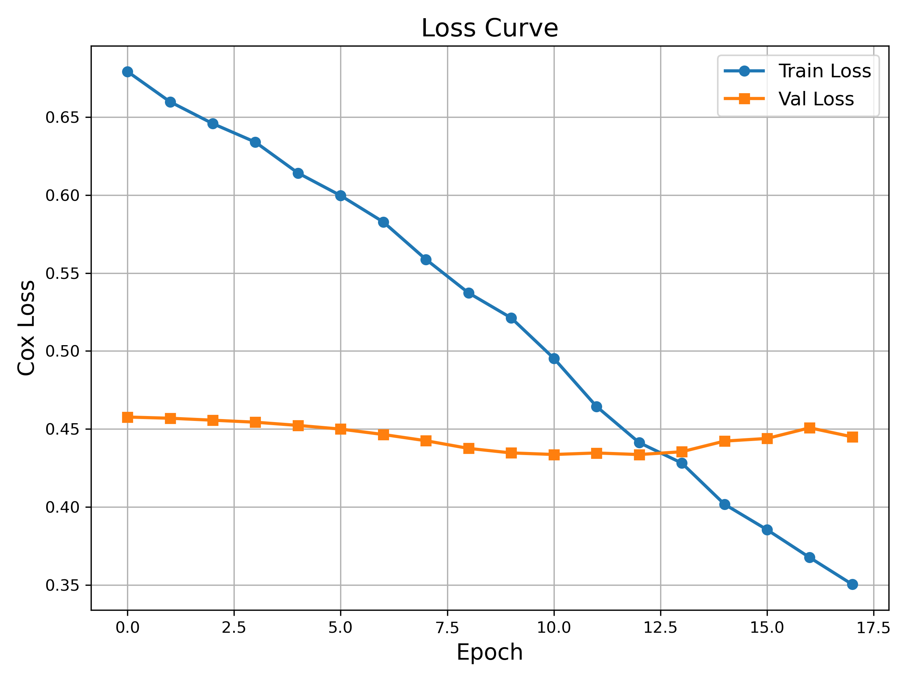
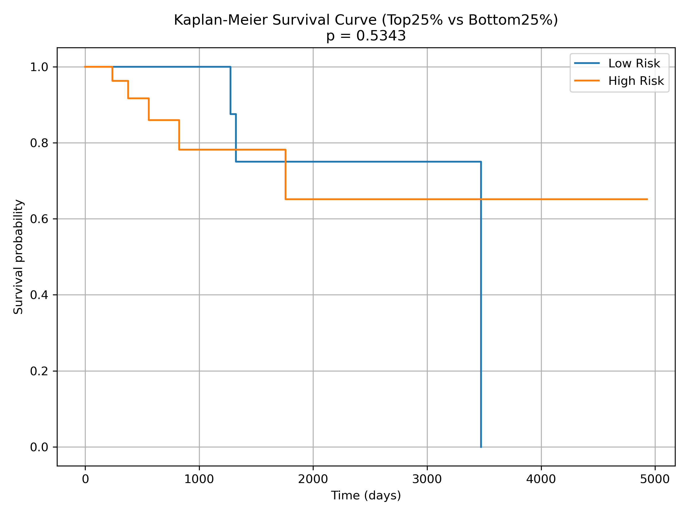

# 🧚 Survival Prediction Using Multi-Omics Data in Breast Cancer (TCGA-BRCA)

This project explores how integrating RNA expression, DNA methylation, and copy number variation (CNV) data can improve survival prediction for breast cancer patients. Using a deep learning-based approach, we aim to capture complex patterns in these omics layers that may be missed by single-omics models.

---

## 🌟 Project Goal

To build a multi-omics model that predicts patient overall survival (OS) time in the TCGA-BRCA dataset and evaluates its predictive power using C-index and Kaplan-Meier curves.

---

## 📚 Data Summary
- **Source**: TCGA-BRCA via UCSC Xena
- **Samples after preprocessing**: 770
- **Omics used**:
  - RNA-seq (log2-normalized)
  - DNA methylation (beta values)
  - Copy Number Variation (CNV)
- **Labels**: Overall survival time + event status

---

## ⚙️ Preprocessing Workflow (`precleaning.py`)

1. **Filter features**:
   - Remove constant features (zero variance)
   - Keep top 1000 features by variance per omics type
2. **Missing values**: Filled with 0
3. **Z-score normalization**: Standardize each omics feature matrix
4. **Sample alignment**: Retain only samples shared across all omics and clinical data
5. **Output**: Cleaned and saved `.pkl` files for input into the model

---

## 🧐 Model Architecture (`train_model_with_val.py`)

Each omics type is passed through its own subnet:
```
Linear(1000 → 128) → BatchNorm → ReLU → Dropout(0.3)
Linear(128 → 64) → BatchNorm → ReLU → Dropout(0.3)
```

Then the outputs of the three subnets (each 64-dim) are concatenated and passed through:
```
Linear(192 → 64) → ReLU → Linear(64 → 1)
```

- **Loss**: Cox Proportional Hazard Loss
- **Optimization**: Adam + StepLR
- **Validation**: 70/15/15 split for training/validation/test
- **Early stopping**: Enabled (patience = 5)

---

## 🔬 Experimental Results

| Metric                                | Value    |
|---------------------------------------|----------|
| Test Set C-Index                      | **0.7150** |
| KM Curve p-value (median split)      | 0.5985   |
| KM Curve p-value (top vs bottom 25%) | 0.5343   |

Although the KM p-values are not significant, the model shows moderate predictive performance (C-index > 0.70), which is promising for multi-omics survival tasks.

---

## ✅ What We Improved

- Top-N feature selection (variance-based)
- Subnet structure per omics
- Dropout + BatchNorm regularization
- Added early stopping and validation monitoring
- Replaced median split KM with top vs bottom 25% for better stratification

---

## 🔄 Ongoing & Future Work

We plan to improve this pipeline in the following ways:

- [ ] Integrate clinical covariates (e.g., stage, age, subtype)
- [ ] Experiment with DeepSurv, OmicsNet, or attention-based fusion networks
- [ ] Add k-fold cross-validation for more robust evaluation
- [ ] Apply SHAP or other interpretation methods to identify top features
- [ ] Tune hyperparameters (learning rate, dropout, hidden size)
- [ ] Package into a reproducible GitHub repo with Jupyter demos or model card

---

## 📈 Visualizations

### Training Loss & Validation Loss


### Kaplan-Meier Curve (Top 25% vs Bottom 25%)


---

## 🗂️ Files in This Repository
```
├── data/
│   ├── *.tsv.gz (not pushed to GitHub)
│   └── tmp/            # contains intermediate .pkl files
├── precleaning.py
├── train_model_with_val.py
├── plot_km_top25.py
├── best_model.pt
├── loss_curve.png
├── km_curve_top25.png
└── README.md
```

---

## 💡 Run Instructions

```bash
python precleaning.py               # step 1: clean & save omics data
python train_model_with_val.py      # step 2: train model with val/test split
python plot_km_top25.py             # step 3: stratify and visualize survival curves
```

---

## 🙏 Acknowledgements

- Data: TCGA-BRCA via UCSC Xena
- Survival evaluation: `lifelines` Python package
- Concepts inspired by DeepSurv, OmicsFusion, and related work

---

If this repo helped you, consider giving it a ⭐ or adapting it for your own survival studies!

